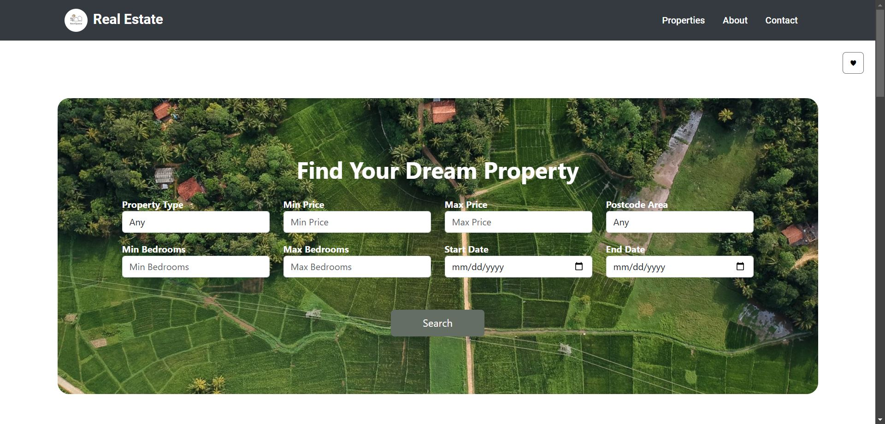

# Next Space

<i>Estate Agent Client-side Web Application</i>

## Description
NextSpace is a client-side web application designed for estate agents to manage and display property listings. Built with React.js and Bootstrap, it provides a responsive and user-friendly interface for searching, viewing, and managing property details. Users can search for properties based on various criteria and view detailed information about each property, including images, price, and type.

### 💻 **Tech Stacks**

## Run Project

This project was bootstrapped with [Create React App](https://github.com/facebook/create-react-app).

### Available Scripts

In the project directory, you can run:
#### `npm install`
Install All the requied dependecies

#### `npm start`
Runs the app in development mode. Open [http://localhost:3000](http://localhost:3000) to view it in your browser.

#### `npm test`
Launches the test runner in interactive watch mode.

#### `npm run build`
Builds the app for production to the `build` folder. It correctly bundles React in production mode and optimizes the build for the best performance.

#### `npm run eject`
**Note: this is a one-way operation. Once you `eject`, you can't go back!** This command will remove the single build dependency from your project.

## Learn More

You can learn more in the [Create React App documentation](https://facebook.github.io/create-react-app/docs/getting-started).

To learn React, check out the [React documentation](https://reactjs.org/).